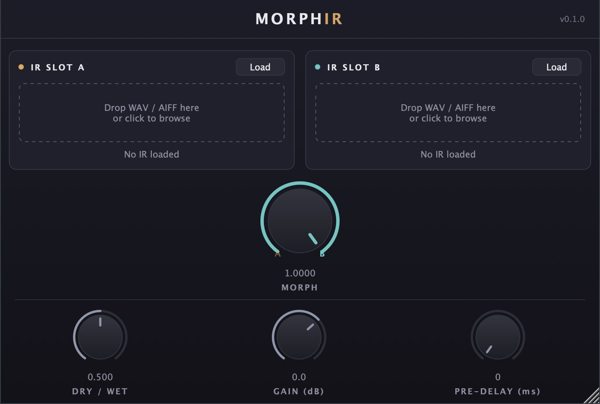

# MorphIR

[](https://github.com/MaxWorgan/morphIR/actions/workflows/build.yml)

A real-time morphing convolution reverb plugin (VST3, AU, CLAP) for macOS.

Load two impulse responses into slots. Sweep the **Morph** knob — or automate it from your DAW — to continuously transition between the acoustic characters of the two IRs. The transition happens via frequency-domain magnitude interpolation, computed on a dedicated background thread and lock-free-swapped into a single non-uniform partitioned convolution (NUPC) engine. There are no parallel reverb engines and no audible crossfade artefact: the reverb tail reflects where you've been; new input responds to where you are.



## Features

- VST3, AU, and CLAP plugin formats
- Stereo (dual mono) processing
- IRs up to 30 seconds at the session sample rate
- WAV / AIFF loading via drag-and-drop or file browser, with waveform display per slot
- Near-zero latency (NUPC small early partitions)
- Lock-free morph thread — audio thread never blocks
- Sample-accurate parameter automation under CLAP

## Parameters

| Parameter      | Range           | Default | Description                                      |
|----------------|-----------------|---------|--------------------------------------------------|
| Morph Position | 0.0 – 1.0       | 0.0     | Blend between slot A (0.0) and slot B (1.0)      |
| Dry/Wet        | 0.0 – 1.0       | 0.5     | Balance between the dry input and reverb output  |
| Output Gain    | −24 dB – +12 dB | 0 dB    | Applied to the final mixed output                |
| Pre-delay      | 0 – 500 ms      | 0 ms    | Delays the wet signal relative to the dry signal |

## Download

Pre-built macOS bundles (VST3, AU, CLAP) are attached to each [GitHub release](https://github.com/MaxWorgan/morphIR/releases), and per-commit builds are available as artefacts on the [Actions page](https://github.com/MaxWorgan/morphIR/actions).

## Building from source

Requires CMake 3.21+, a C++20 compiler, and the Xcode command line tools. macOS only for now. JUCE and clap-juce-extensions are fetched automatically by CMake on first configure — no SDKs to install.

```bash
cmake -B build -DCMAKE_BUILD_TYPE=Release
cmake --build build --target MorphIR_All   # AU + VST3 + Standalone
cmake --build build --target MorphIR_CLAP  # CLAP
```

Build artefacts land in `build/MorphIR_artefacts/Release/{AU,VST3,CLAP,Standalone}/`.

## Running tests

The engine (FFT, convolution, IR loading, morphing, threading) is covered by a unit test suite that builds without the plugin wrapper:

```bash
cmake --build build --target MorphIR_Tests
./build/MorphIR_Tests
```

Tests also run on every push and pull request via [GitHub Actions](.github/workflows/build.yml).

## Installing locally

Copy or symlink the built bundles to the standard plugin folders (adjust `Release` to match your build type):

```bash
ln -sf "$PWD/build/MorphIR_artefacts/Release/AU/MorphIR.component" ~/Library/Audio/Plug-Ins/Components/
ln -sf "$PWD/build/MorphIR_artefacts/Release/VST3/MorphIR.vst3"    ~/Library/Audio/Plug-Ins/VST3/
ln -sf "$PWD/build/MorphIR_artefacts/Release/CLAP/MorphIR.clap"    ~/Library/Audio/Plug-Ins/CLAP/
```

After symlinking, rescan plugins in your DAW. AU may additionally require `killall -9 AudioComponentRegistrar` (or a logout) before Logic picks it up.

## Project layout

```
engine/   DSP core — no JUCE GUI dependencies
  fft/      FFTProvider abstraction (vDSP on macOS)
  ir/       IR file loading and slot management
  morph/    SpectralMorpher + background MorphThread
  nupc/     Non-uniform partitioned convolution engine
src/      JUCE plugin — processor, editor, UI components
tests/    Unit tests for the engine
docs/     PRD and architecture decision records
```

## Architecture

See [`docs/PRD.md`](docs/PRD.md) for the full design and [`docs/adr/`](docs/adr/) for individual architecture decisions:

- **ADR 0001**: Non-uniform partitioned convolution for IR processing
- **ADR 0002**: Double-buffering with atomic pointer swap for IR hot-swap
- **ADR 0003**: vDSP on macOS, FFTW on Linux, behind FFTProvider abstraction

Domain vocabulary is defined in [`CONTEXT.md`](CONTEXT.md).

## License

GPL intended — to be confirmed when the LICENSE file is added.
